# System Architecture

**Version:** 1.0.0  
**Last Updated:** 2026-04-28  
**Architecture Type:** Data-driven, component-based video composition

## Architecture Overview

Betacom News Video is built on a **data-driven, pipeline architecture** where:

1. **User edits** `news.json` (structured content)
2. **Generator script** orchestrates TTS and produces voiceover manifest
3. **Metadata calculator** reads manifest, measures audio durations, computes frame counts
4. **Composition engine** (Remotion) renders layout with transitions and animations
5. **Render pipeline** produces final MP4 video

The system emphasizes **modularity** (pluggable styles), **idempotency** (hash-based dedup), and **determinism** (frame-exact video output).

---

## High-Level Data Flow

```mermaid
graph LR
    A["news.json<br/>(user content)"] -->|npm run voiceover| B["TTS Provider<br/>(ElevenLabs/Google)"]
    B -->|synthesize text| C["public/voiceover/<br/>(MP3 + manifest)"]
    C -->|npm run dev / render| D["calculateMetadata<br/>(Root.tsx)"]
    D -->|measure audio| E["Mediabunny<br/>(duration)"]
    E -->|return frames| F["NewsVideo<br/>Component"]
    F -->|getStyle| G["Style Preset<br/>(centered-bold/<br/>text-image-card/)"]
    G -->|render scenes| H["TransitionSeries<br/>(Title → Segments → Outro)"]
    H -->|snapshots| I["Remotion CLI<br/>(encode H.264)"]
    I -->|render| J["out/video.mp4"]
    
    style A fill:#e1f5ff
    style B fill:#fff3e0
    style C fill:#fff3e0
    style D fill:#f3e5f5
    style F fill:#e8f5e9
    style H fill:#e8f5e9
    style I fill:#fce4ec
    style J fill:#fce4ec
```



---

## Render Pipeline (Detailed)

### Phase 1: Content Editing

**Input:** User edits `src/data/news.json`

**Schema (NewsData):**
```typescript
{
  "title": "Headline",
  "date": "DD/MM/YYYY",
  "highlight": "keyword-to-accent",  // Optional
  "style": "centered-bold",           // Optional, defaults to "centered-bold"
  "titleImage": "filename.jpg",       // Optional
  "segments": [
    {
      "text": "On-screen text",
      "voiceText": "Narration (optional, falls back to text)",
      "image": "filename.jpg"          // Optional
    }
  ]
}
```

**Validation:** TypeScript `NewsData` type enforces structure at compile time. Runtime no additional validation (assume valid JSON).

---

### Phase 2: Voiceover Generation

**Trigger:** `npm run voiceover`

**Script:** `scripts/generate-voiceover.ts` (141 LOC)

**Process:**
```
1. Load news.json
2. Load existing public/voiceover/manifest.json (or create empty)
3. Instantiate TTS provider based on TTS_PROVIDER env var
4. For each scene (title, segments[0..N], outro):
   a. Extract voiceText (or fall back to text)
   b. Compute SHA-256 hash of voiceText (12-char prefix)
   c. Check manifest: does this hash exist?
      - YES: skip (text unchanged)
      - NO: call provider.synthesize(voiceText)
   d. Write MP3 to public/voiceover/{sceneId}.mp3
   e. Update manifest entry
5. Write public/voiceover/manifest.json
```

**Hash-Based Dedup:**
```
Text: "Phí cố định tăng từ 1.5% lên 2.5%"
Hash: "a3b2c1d4e5f6g7..." (SHA-256, 12-char)

Manifest Entry:
{
  "id": "seg-01",
  "text": "Phí cố định tăng từ 1.5% lên 2.5%",
  "textHash": "a3b2c1d4e5f6",
  "file": "voiceover/seg-01.mp3"
}

If user edits text: new hash → trigger re-synthesis
If user doesn't change: hash matches → skip (same MP3)
```

**Provider Abstraction:**

Both providers implement `TTSProvider` interface:
```typescript
interface TTSProvider {
  name: "ElevenLabs" | "Google";
  voiceId: string;           // Voice ID from env var
  modelId: string;           // Model version (for tracking)
  synthesize(text: string): Promise<Buffer>;  // Returns MP3 bytes
}
```

**ElevenLabs Implementation** (`scripts/tts-providers/elevenlabs.ts`):
- Uses `@elevenlabs/elevenlabs-js` SDK
- Model: `ELEVENLABS_MODEL_ID` (default: `eleven_v3`)
- Voice: `ELEVENLABS_VOICE_ID` (default: Vietnamese library voice if Pro)
- Bitrate: 128 kbps (ElevenLabs default)

**Google Cloud Implementation** (`scripts/tts-providers/google.ts`):
- REST API (no SDK needed)
- Locale: `vi-VN` (Vietnamese)
- Voice: `GOOGLE_TTS_VOICE_ID` (default: `vi-VN-Wavenet-D`)
- SSML support for prosody control (optional)
- Bitrate: 128 kbps (Google default)

**Output Manifest:**
```json
{
  "provider": "ElevenLabs",
  "voiceId": "3VnrjnYrskPMDsapTr8X",
  "modelId": "eleven_v3",
  "entries": {
    "title": {
      "id": "title",
      "text": "Chính sách phí Shopee...",
      "textHash": "a3b2c1d4e5f6",
      "file": "voiceover/title.mp3"
    },
    "seg-01": { ... },
    "seg-02": { ... },
    "outro": { ... }
  }
}
```

---

### Phase 3: Metadata Calculation

**Trigger:** When Remotion Studio loads or `remotion render` is invoked

**Component:** `src/Root.tsx` → `calculateNewsMetadata()` (CalculateMetadataFunction)

**Purpose:** Determine total video duration and per-scene frame counts based on audio lengths.

**Process:**

```typescript
async calculateNewsMetadata({ props }) {
  // 1. Try to load manifest
  const manifest = await tryLoadManifest();
  
  if (manifest exists && all entries present) {
    // 2. Measure each audio file duration (no FFmpeg needed)
    const titleDur = await getAudioDuration(staticFile(manifest.entries.title.file));
    const outroDur = await getAudioDuration(staticFile(manifest.entries.outro.file));
    const segDurs = await Promise.all(
      segments.map((_, i) => getAudioDuration(...))
    );
    
    // 3. Add padding (prevents audio cutoff)
    const titleFrames = Math.ceil((titleDur + 0.4) * 30);
    const segFrames = segDurs.map(d => Math.ceil((d + 0.4) * 30));
    const outroFrames = Math.ceil((outroDur + 0.4) * 30);
    
    // 4. Compute total, subtract transitions
    const totalFrames = titleFrames + sum(segFrames) + outroFrames;
    const numTransitions = segments.length + 1;  // title→seg, seg-to-seg, seg→outro
    const durationInFrames = totalFrames - numTransitions * 12;
    
    return {
      durationInFrames,
      props: { ...props, voiceover, sceneFrames }
    };
  } else {
    // Fallback: manifest missing or incomplete
    // Use hardcoded defaults
    return {
      durationInFrames: 300,
      props: { ...props }
    };
  }
}
```

**Audio Duration Measurement:**
- Library: `mediabunny` (WASM-based, no FFmpeg dependency)
- Input: Path to MP3 file (from manifest)
- Output: Duration in seconds (float)
- Runs in Node.js (no browser required)

**Padding Logic:**
```
Audio duration: 3.2 seconds
Padding: 0.4 seconds (AUDIO_PADDING_SECONDS)
Total scene time: 3.2 + 0.4 = 3.6 seconds
FPS: 30 frames/second
Frame count: ceil(3.6 × 30) = 108 frames
```

**Fallback Constants** (if manifest missing):
- `TITLE_SECONDS = 3` → 90 frames
- `SEGMENT_SECONDS = 5` → 150 frames
- `OUTRO_SECONDS = 2` → 60 frames

**Transition Overlap:**
```
Transition frames: 12 per transition

Example: 4 segments
Total transitions: 1 (title→seg0) + 3 (seg0→seg1, seg1→seg2, seg2→seg3) + 1 (seg3→outro) = 5
Overlap loss: 5 × 12 = 60 frames

durationInFrames = totalSceneFrames - 60
```

---

### Phase 4: Composition & Layout

**Component:** `src/Composition.tsx` → `NewsVideo` React component (79 LOC)

**Input Props:**
- `title, date, highlight, style, titleImage, segments` (from news.json)
- `voiceover` (from manifest, set by calculateMetadata)
- `sceneFrames` (computed by calculateMetadata)

**Layout Structure:**
```
<TransitionSeries>
  
  <Sequence durationInFrames={titleFrames}>
    <Title {...props} />
  </Sequence>
  
  <Transition presentation={slide({direction: "from-bottom"})} timing={12 frames} />
  
  {segments.map((seg, i) => (
    <>
      <Sequence durationInFrames={segFrames[i]}>
        <Segment {...seg, index={i}, total={segments.length}} />
      </Sequence>
      
      {i < segments.length - 1 && (
        <Transition presentation={slide({direction: "from-right"})} timing={12 frames} />
      )}
    </>
  ))}
  
  <Transition presentation={fade()} timing={12 frames} />
  
  <Sequence durationInFrames={outroFrames}>
    <Outro {...props} />
  </Sequence>
  
</TransitionSeries>
```

**Transitions Explained:**

| Transition | Direction | Use Case | Effect |
|---|---|---|---|
| slide | `from-bottom` | Title → Segment 0 | Content enters from bottom (fresh start feel) |
| slide | `from-right` | Segment N → Segment N+1 | Content enters from right (rhythm, continuation) |
| fade | N/A | Last segment → Outro | Smooth fade (closure, conclusion) |

**Transition Timing:** All transitions are 12 frames at 30 fps = 0.4 seconds. Overlaps with adjacent scenes (no gap).

**Style Lookup:**
```typescript
const { Title, Segment, Outro } = getStyle(style);
// If style = "text-image-card" → looks up registry, returns components
// If style undefined/unknown → defaults to "centered-bold"
```

---

### Phase 5: Style Rendering

Each style is a folder under `src/styles/{name}/` with three components.

**Style Registry Pattern:**

```typescript
// src/styles/registry.ts
export type StyleName = "centered-bold" | "text-image-card";

export type StyleModule = {
  Title: React.FC<{ title, date, highlight?, audioSrc?, image? }>;
  Segment: React.FC<{ text, index, total, audioSrc?, image? }>;
  Outro: React.FC<{ audioSrc? }>;
};

export const STYLES: Record<StyleName, StyleModule> = {
  "centered-bold": { Title: ..., Segment: ..., Outro: ... },
  "text-image-card": { Title: ..., Segment: ..., Outro: ... }
};

export const getStyle = (name?: string): StyleModule => {
  if (name && name in STYLES) return STYLES[name as StyleName];
  return STYLES["centered-bold"];  // Default
};
```

**Shared Components Used by All Styles:**

1. **Background.tsx** — Dark gradient + cyan dot grid + vignette mask (shared visual foundation)
2. **KenBurnsImage.tsx** — Image with slow zoom-in + pan animation
3. **SceneAudio.tsx** — Audio wrapper (no-op if src undefined)

**Example: text-image-card/Segment.tsx**

```typescript
export const Segment: React.FC<{
  text: string;
  index: number;
  total: number;
  audioSrc?: string;
  image?: string;
}> = ({ text, index, total, audioSrc, image }) => {
  return (
    <div>
      <Background />
      
      {image && <KenBurnsImage src={publicImages(image)} />}
      
      <div className="text-headline">
        {text}
      </div>
      
      <ProgressBar current={index + 1} total={total} />
      
      <SceneAudio src={audioSrc} />
    </div>
  );
};
```

**Layering (Z-index Conceptual):**
```
Layer 4: Text, UI elements (progress bar, index counter)
Layer 3: Image card (centered, with border)
Layer 2: Background gradient
Layer 1: Base (Remotion video surface)

Audio plays on all layers
```

---

### Phase 6: Render & Output

**Trigger:** `remotion render NewsVideo out/video.mp4`

**Remotion CLI Process:**
1. Load `src/index.ts` (Remotion entry)
2. Instantiate `RemotionRoot` component
3. Run `calculateMetadata` (async)
4. Serialize `NewsVideo` component with computed props
5. Take snapshots for each frame (WebGL rendering via Chromium)
6. Encode snapshots to H.264 MP4 (via ffmpeg, built-in)
7. Mix audio tracks (voiceover) into final file
8. Write to `out/video.mp4`

**Output Specs:**
- Resolution: 1080×1920 (vertical)
- Codec: H.264 (AVC)
- FPS: 30 frames per second
- Audio: Stereo, 128 kbps (from TTS provider)
- Container: MP4 (MPEG-4)
- Typical size: 20–50 MB for 90 seconds

**Frame-Perfect Output:**
Every frame is deterministic (same props → same video). No randomness or timing jitter.

---

## Component Hierarchy

```
RemotionRoot
└── Composition
    ├── id="NewsVideo"
    ├── component={NewsVideo}
    ├── durationInFrames={calculated from audio}
    └── props={newsData + voiceover + sceneFrames}

NewsVideo (TransitionSeries)
├── Title Component (from selected style)
│   ├── Background
│   ├── KenBurnsImage (if titleImage provided)
│   ├── Headline text
│   └── SceneAudio (title voiceover)
├── [slide from-bottom transition]
├── Segment[0] Component
│   ├── Background
│   ├── KenBurnsImage (if image provided)
│   ├── Text + progress bar
│   └── SceneAudio (voiceover)
├── [slide from-right transition]
├── ... (more segments)
├── [fade transition]
└── Outro Component
    ├── Background
    ├── Closing text
    └── SceneAudio (outro voiceover)
```

---

## Data Structures & Types

### NewsData (Main Props Type)

```typescript
export type NewsData = {
  title: string;              // "Chính sách phí Shopee..."
  date: string;               // "28/04/2026"
  highlight?: string;         // "01/05/2026" (optional)
  style?: string;             // "centered-bold" (optional, defaults)
  titleImage?: string;        // "shopee-logo.png" (optional)
  segments: NewsSegment[];    // Content array
  voiceover?: Voiceover;      // Set by calculateMetadata
  sceneFrames?: SceneFrames;  // Set by calculateMetadata
};
```

### NewsSegment

```typescript
export type NewsSegment = {
  text: string;               // On-screen bullet
  voiceText?: string;         // Narration (if different from text)
  image?: string;             // Image filename (optional)
};
```

### Voiceover (Internal, Set by calculateMetadata)

```typescript
export type Voiceover = {
  title?: string;             // "voiceover/title.mp3"
  segments?: string[];        // ["voiceover/seg-01.mp3", ...]
  outro?: string;             // "voiceover/outro.mp3"
};
```

### SceneFrames (Internal, Set by calculateMetadata)

```typescript
export type SceneFrames = {
  title: number;              // Frame count (e.g., 108)
  segments: number[];         // Frame count per segment
  outro: number;              // Frame count (e.g., 60)
};
```

### VoiceoverManifest (Generated by voiceover script)

```typescript
export type VoiceoverManifest = {
  provider: "ElevenLabs" | "Google";
  voiceId: string;
  modelId: string;
  entries: Record<string, {
    id: string;
    text: string;
    textHash: string;
    file: string;
  }>;
};
```

---

## Style Preset Architecture

### Adding a New Style (Example: "magazine-split")

**Step 1: Create folder**
```
src/styles/magazine-split/
├── Title.tsx
├── Segment.tsx
├── Outro.tsx
└── index.ts
```

**Step 2: Implement components**
```typescript
// src/styles/magazine-split/Segment.tsx
export const Segment: React.FC<{
  text: string;
  index: number;
  total: number;
  audioSrc?: string;
  image?: string;
}> = ({ text, index, total, audioSrc, image }) => {
  return (
    <div className="magazine-layout">
      <Background />
      <div className="headline-column">
        {text}
      </div>
      <div className="image-column">
        {image && <KenBurnsImage src={publicImages(image)} />}
      </div>
      <ProgressBar current={index + 1} total={total} />
      <SceneAudio src={audioSrc} />
    </div>
  );
};
```

**Step 3: Export from index.ts**
```typescript
// src/styles/magazine-split/index.ts
export { Title } from "./Title";
export { Segment } from "./Segment";
export { Outro } from "./Outro";
```

**Step 4: Register in registry**
```typescript
// src/styles/registry.ts
import * as MagazineSplit from "./magazine-split";

export type StyleName = 
  | "centered-bold" 
  | "text-image-card" 
  | "magazine-split";  // ← Add here

export const STYLES: Record<StyleName, StyleModule> = {
  "centered-bold": CenteredBold,
  "text-image-card": TextImageCard,
  "magazine-split": MagazineSplit,  // ← Add here
};
```

**Step 5: Use in news.json**
```json
{
  "title": "...",
  "style": "magazine-split",  // ← Use here
  ...
}
```

---

## Error Handling Strategy

### During Voice Generation (`npm run voiceover`)

| Scenario | Behavior | Fallback |
|---|---|---|
| API key missing | Throw error (halt) | User must add `.env` key |
| Synthesis fails | Log error, skip entry, continue | Re-run voiceover after fixing API |
| Manifest missing | Create empty, start fresh | Regenerate all audio |
| Text unchanged | Skip (hash match) | Use existing MP3 |

### During Metadata Calculation

| Scenario | Behavior | Fallback |
|---|---|---|
| Manifest missing | Skip async load | Use hardcoded constants (TITLE_SECONDS, etc.) |
| Audio duration fails | Log warning, use fallback | Default 5 seconds per segment |
| Invalid manifest JSON | Catch, return null | Treat as manifest missing |

### During Composition Rendering

| Scenario | Behavior | Fallback |
|---|---|---|
| Image file missing | Remotion logs warning | Component renders without image |
| Audio file missing | No-op (SceneAudio checks src) | Scene renders without audio |
| Invalid style name | Lookup fails, use DEFAULT_STYLE | "centered-bold" always available |

---

## Performance Considerations

### Render Pipeline Bottlenecks

1. **Voice Generation (TTS API latency)**
   - ~1–2 seconds per segment (ElevenLabs/Google)
   - Mitigated by hash-based dedup (70% of scenes skip re-synthesis)

2. **Audio Duration Measurement**
   - Mediabunny: WASM-based, ~50–100ms per file
   - Parallelized with `Promise.all()` in calculateMetadata

3. **Video Encoding**
   - Remotion + ffmpeg: ~30–60 seconds for 90-second video
   - Hardware-dependent (CPU cores, RAM)
   - Typical: 4-core CPU = 1 frame per second encode speed

### Optimization Strategies

- **Hash-based dedup:** Only re-synthesize changed text
- **Parallel audio duration queries:** `Promise.all()` in calculateMetadata
- **Lazy image loading:** Remotion's `` handles memory automatically
- **Snapshot caching:** Remotion Studio caches snapshots during preview

---

## Extension Points

### Add a New TTS Provider

**Interface:** `scripts/tts-providers/types.ts`

```typescript
export interface TTSProvider {
  name: string;
  voiceId: string;
  modelId: string;
  synthesize(text: string): Promise<Buffer>;
}
```

**Steps:**
1. Create `scripts/tts-providers/azure.ts` (example: Azure Speech Services)
2. Implement TTSProvider interface
3. Export factory function: `createAzureProvider()`
4. Add case to `buildProvider()` in `generate-voiceover.ts`
5. Add env vars to `.env.example`

### Add Image Effects

**Extend KenBurnsImage.tsx** or create new component:

```typescript
export const ParallaxImage: React.FC<{
  src: string;
  offset?: number;
}> = ({ src, offset = 10 }) => {
  return ;
};
```

Then use in a style's Segment component.

### Add Background Music (BGM)

**Pattern:** Add optional `bgm?: string` to NewsData

```typescript
// In Composition.tsx
{bgm && (
  <Audio src={bgm} volume={0.3} />  // Voiceover plays at default volume
)}
```

Then in style components: `<Audio src={voiceover?.segments[i]} />` continues at normal volume.

---

## Deployment Architecture (Future)

**Current:** Local rendering only (Remotion CLI)

**Planned (v2):**
```
News CMS → API webhook → Lambda (Docker + Remotion)
                          ↓
                    Render video
                          ↓
                    Upload to S3
                          ↓
                    Return signed URL
```

Would require:
- Docker image with Remotion + ffmpeg
- AWS Lambda + S3 integration
- Manifest-based caching for audio (shared across renders)

---

## Technology Stack

| Layer | Technology | Version |
|---|---|---|
| **Runtime** | Node.js + Chromium (Remotion) | 4.0.452 |
| **Framework** | React | 19.2.3 |
| **Language** | TypeScript | 5.9.3 |
| **Video Compositing** | Remotion | 4.0.452 |
| **Audio Effects** | @remotion/media | 4.0.452 |
| **Transitions** | @remotion/transitions | 4.0.452 |
| **Fonts** | @remotion/google-fonts | 4.0.452 |
| **Audio Duration** | mediabunny | 1.41.0 |
| **TTS (ElevenLabs)** | @elevenlabs/elevenlabs-js | 2.45.0 |
| **TTS (Google)** | REST API | — |
| **Styling** | Tailwind CSS | 4.0.0 |
| **Linting** | ESLint | 9.19.0 |
| **Formatter** | Prettier | 3.8.1 |

---

## Diagrams

### Render Pipeline (Timeline View)

```
Time (seconds)
0──────────────────────────────────────── → 90s

Title (3s audio + 0.4s pad)
███████ 3.4s (102 frames)
         ├─[transition: 0.4s]
         └─ (overlaps)
         Segment 0 (5s audio + 0.4s pad)
         ██████████ 5.4s (162 frames)
                     ├─[transition: 0.4s]
                     └─ (overlaps)
                     Segment 1 (5s audio + 0.4s pad)
                     ██████████ 5.4s (162 frames)
                                 └─[transition: 0.4s, fade]
                                 Outro (2s audio + 0.4s pad)
                                 ██████ 2.4s (72 frames)

Total: ~112 + 162 + 162 + 72 - (4 transitions × 12 frames)
     = ~508 - 48 = ~460 frames = ~15.3 seconds @ 30fps
```

### Module Dependency Graph

```
                    Root.tsx
                    (entry)
                      ↓
    ┌─────────────────┼─────────────────┐
    ↓                 ↓                 ↓
Composition.tsx   types.ts      get-audio-duration.ts
    ↓                            (uses mediabunny)
registry.ts
    ↓
  Styles
  ├── centered-bold/
  │   ├── Title.tsx ─────┐
  │   ├── Segment.tsx ──→ Background.tsx
  │   └── Outro.tsx ──→  KenBurnsImage.tsx
  │                      SceneAudio.tsx
  │
  └── text-image-card/
      ├── Title.tsx ─────┐
      ├── Segment.tsx ──→ (same reusable components)
      └── Outro.tsx ────┘

scripts/
├── generate-voiceover.ts
└── tts-providers/
    ├── types.ts
    ├── elevenlabs.ts
    └── google.ts
```

---

## Summary

The system is **modular, data-driven, and extensible**:

1. **Content is JSON** — Users edit data, not code
2. **Metadata is computed** — Frame counts auto-calculated from audio durations
3. **Styles are pluggable** — Registry pattern enables easy style additions
4. **TTS is abstracted** — Swap providers without touching render code
5. **Idempotency is built-in** — Hash-based dedup prevents wasteful re-rendering
6. **Rendering is deterministic** — Same input → identical video output (frame-perfect)

This architecture supports rapid content creation while maintaining video quality and consistency.
